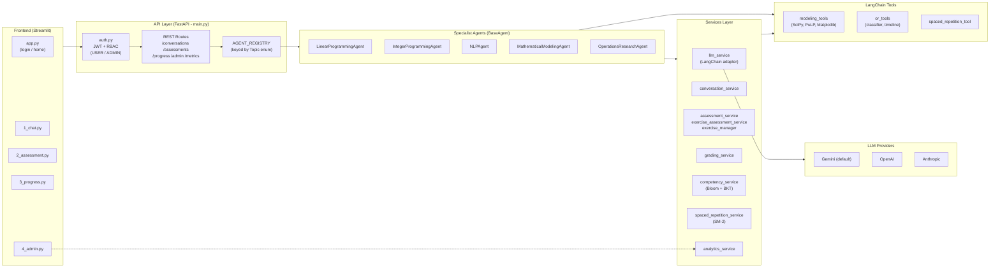
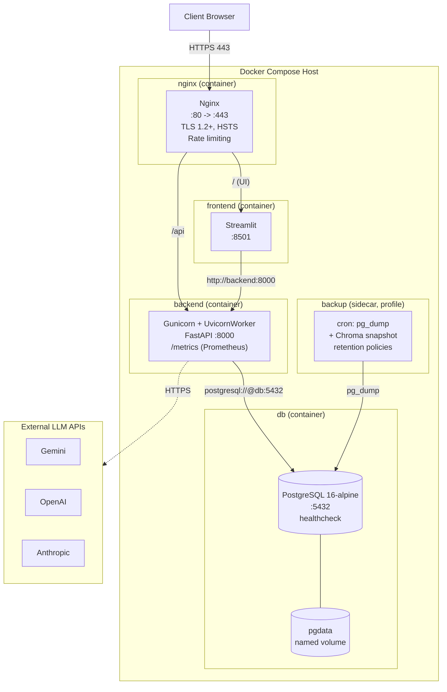
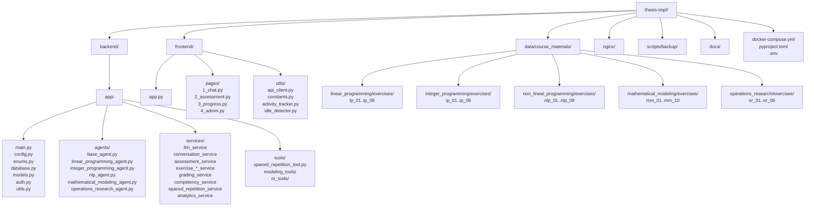
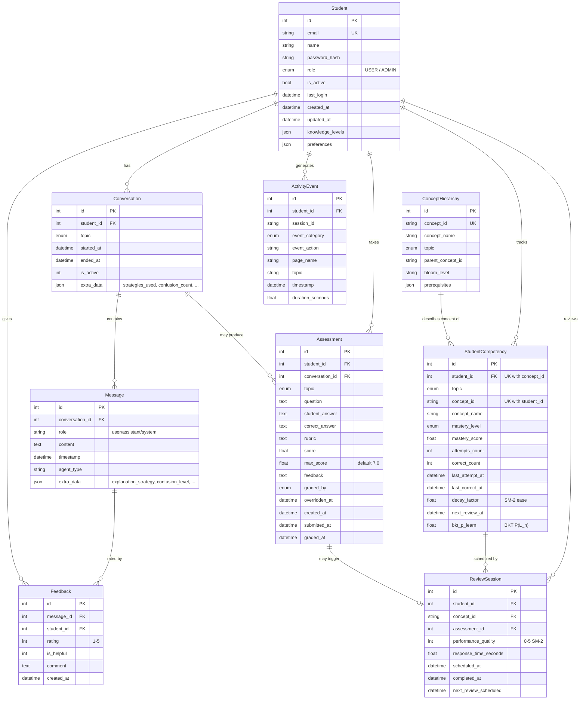

# Application Architecture

## Logical View

The diagram shows the system organized in five horizontal layers. The **Frontend** layer is a Streamlit multi-page app with a Spanish-language UI: `app.py` handles authentication, and the four numbered pages (`1_chat`, `2_assessment`, `3_progress`, `4_admin`) expose the core student and administrator workflows. All pages talk to the **API Layer** through a singleton HTTP client (`frontend/utils/api_client.py`) that injects the JWT token and auto-logs out on 401.

The **API Layer** is implemented in `backend/app/main.py` as a FastAPI application. Every request is filtered through `auth.py` (JWT verification, password hashing, `get_current_user` / `get_current_admin_user` dependencies that enforce the `USER` / `ADMIN` role split). Inside the API layer, the `AGENT_REGISTRY` dictionary is the central dispatch point: incoming chat requests carry a `Topic` enum value (`linear_programming`, `integer_programming`, `nonlinear_programming`, `mathematical_modeling`, `operations_research`) which is mapped to the corresponding agent instance.

The **Agents** layer contains the five specialist agents, all inheriting from `BaseAgent`. The base class implements the adaptive-learning cross-cutting concerns that flow through every agent: keyword-based confusion detection, selection among seven explanation strategies (step-by-step, example-based, analogy, etc.), explicit feedback requests, and spaced-repetition context injection. Each subclass adds its own system prompt and the tools it is allowed to invoke.

The **Services Layer** orchestrates persistent state and domain logic. `llm_service` is a thin LangChain adapter that lets the same agent code run against Gemini, OpenAI, or Anthropic depending on the `LLM_PROVIDER` env var, with full tool-calling support. `conversation_service` and `assessment_service` handle chat history and quizzes; `grading_service` performs LLM-based auto-grading on the Chilean 1.0–7.0 scale with admin override; `competency_service` tracks per-concept mastery using a Bloom-taxonomy concept hierarchy plus a Bayesian Knowledge Tracing posterior; `spaced_repetition_service` schedules reviews with the SM-2 algorithm; and `analytics_service` aggregates activity events for the admin dashboard (dashed arrow in the diagram).

The **Tools** column captures the LangChain-compatible callables exposed to the LLM during tool-calling: `modeling_tools` (problem solver via SciPy/PuLP, feasible-region plots via Matplotlib, model and exercise validators, practice problem generator), `or_tools` (problem classifier and OR history timeline), and `spaced_repetition_tool` (`SpacedRepetitionReviewTool`), which lets the agent start or fetch an SM-2 review session mid-conversation.

Finally, the **LLM Providers** block at the right represents the external services actually generating responses. Provider selection is configuration-driven, so the agent code itself is provider-agnostic.

## Deployment View

The diagram shows the physical topology of the system as deployed by `docker-compose.yml`. Every box inside the **Docker Compose Host** is a long-running container managed by Compose with `restart: unless-stopped`. The only entry point exposed to the outside world is the **nginx** container, which terminates TLS on `:443` (certificates mounted read-only from `./nginx/ssl`), upgrades plain HTTP on `:80`, enforces HSTS and TLS 1.2+, and applies request-rate limiting. Nginx then reverse-proxies to either the Streamlit UI or the FastAPI backend based on URL prefix.

The **frontend** container runs Streamlit on `:8501`. It is not exposed to the host network — only Nginx reaches it via Compose's internal DNS. The frontend reads `BACKEND_URL=http://backend:8000` from the environment, which is how the Streamlit pages talk to the API: through the internal Docker network using the service name `backend` as the hostname.

The **backend** container runs FastAPI behind Gunicorn with `UvicornWorker`. It exposes `:8000` only inside the Compose network and serves the JSON API plus a `/metrics` Prometheus endpoint (unauthenticated by design, so it must be blocked at the proxy in production). It connects to the database with `postgresql://...@db:5432/...` — again resolving `db` via Compose's internal DNS — using a SQLAlchemy connection pool (`pool_size=5`, `max_overflow=10`) with `pool_pre_ping=True` for resilience.

The **db** container is `postgres:16-alpine` with a `pg_isready` healthcheck. The `depends_on: condition: service_healthy` constraints in `docker-compose.yml` mean the backend will not start until Postgres is accepting connections, and the frontend in turn waits for the backend. Data durability is provided by the `pgdata` named volume (bottom-right of the database box), which survives container restarts and recreations.

The **backup** container is a sidecar gated by a Compose profile (`profiles: ["backup"]`), so it only runs when explicitly enabled. It executes `pg_dump` against the `db` service on a cron schedule (`BACKUP_SCHEDULE`, default `0 2 * * *`), snapshots the Chroma vector store from a read-only bind mount (`./chroma_db`), and applies count- and age-based retention policies. A weekly `RESTORE_SMOKE_TEST_SCHEDULE` validates that backups are actually restorable.

The dashed arrows on the right show that the backend container makes outbound HTTPS calls to the **External LLM APIs** (Gemini by default, with OpenAI and Anthropic as alternatives) — these are the only egress paths from the host that the application itself opens.

Together this topology satisfies the main non-functional requirements: **availability** through restart policies and healthcheck-gated startup; **security** through TLS termination, HSTS, rate limiting, and bcrypt-hashed credentials never leaving the backend; **scalability** through Gunicorn workers and the connection pool; and **durability** through the named volume plus the backup sidecar.

## Implementation View

The tree mirrors the layered organization of the Logical View, but at the file-and-package level so developers can locate code quickly. At the repository root, deployment artifacts (`docker-compose.yml`, `nginx/`, `scripts/backup/`) sit next to source trees (`backend/`, `frontend/`), shared content (`data/course_materials/`), and the configuration files that hold everything together (`pyproject.toml` for Python tooling and dependencies, `.env` for runtime settings consumed by `backend/app/config.py`).

Inside `backend/app/` — the box on the left of the diagram — the **core modules** are deliberately flat: `main.py` declares every route and the lifespan, `config.py` loads typed settings via `pydantic-settings`, `enums.py` is the single source of truth for cross-cutting enums (`Topic`, `KnowledgeLevel`, `MessageRole`, `UserRole`, `GradingSource`, `MasteryLevel`, `EventCategory`) and is re-exported from `database.py` and `models.py` for compatibility, `database.py` contains all SQLAlchemy models plus the engine and session factory, `models.py` holds Pydantic request/response schemas, `auth.py` centralizes JWT and password handling, and `utils.py` collects small helpers (confusion detection, error formatting).

Three subpackages branch off from `app/` and correspond directly to the Logical View layers. `agents/` contains one file per specialist agent plus the `base_agent.py` ABC; note that the nonlinear-programming agent lives in `nlp_agent.py` (not the older `nonlinear_programming_agent.py`, which is unused). `services/` is the orchestration layer — each `*_service.py` encapsulates one domain capability (LLM access, conversations, assessments, exercises, grading, competency, spaced repetition, analytics). `tools/` holds LangChain-compatible callables: `spaced_repetition_tool.py` at the package root, plus `modeling_tools/` (problem solver, region visualizer, model and exercise validators, practice generator) and `or_tools/` (problem classifier, timeline explorer) as nested packages so agents can import only what they need.

On the right, `frontend/` follows the Streamlit "page-per-feature" convention: the `pages/` directory is filename-ordered (`1_chat.py`, …, `4_admin.py`), and `utils/` holds the shared HTTP client and small UI helpers (`activity_tracker.py` and `idle_detector.py` are what feed the backend `analytics_service`).

The `data/course_materials/` subtree at the bottom of the diagram is content, not code. Each topic has an `exercises/` folder containing per-exercise directories (`lp_01`, `mm_07`, etc.) with `statement.md` and `model.md` files. This layout is what `services/exercise_manager.py` walks at startup to populate the pre-built exercise registry consumed by `exercise_assessment_service` and the modeling tools' `exercise_validator` / `exercise_practice`.

This structure keeps the boundaries between agents, services, and tools enforced by the directory layout, concentrates shared concerns in a small set of root-level modules, and reduces adding a new topic to creating one agent file, one exercise folder, and registering the topic in `AGENT_REGISTRY`.

## Data View

The ER diagram captures the nine tables defined in `backend/app/database.py`. An important architectural caveat: although every cross-table column in the diagram is annotated `FK`, the SQLAlchemy models intentionally **declare no foreign-key constraints** — `student_id`, `conversation_id`, `concept_id`, etc. are plain `Integer` / `String` columns. The relationships drawn are therefore logical only, enforced at the application layer (in the services) rather than by the database. Every table also carries an `extra_data` JSON column, used as a flexible escape hatch for metadata that does not deserve its own column yet.

At the centre of the model is **`Student`**, the root of all per-user data. It stores authentication state (`email` is unique, `password_hash` is bcrypt-hashed), role (`USER` / `ADMIN`), and two JSON columns that carry adaptive-learning context outside the relational schema: `knowledge_levels` (one entry per `Topic`, defaulting to `beginner`) and `preferences` (free-form, populated as the system infers a student's profile).

**`Conversation`** and **`Message`** model the chat history. A conversation is scoped to a single `Topic`, has lifecycle timestamps (`started_at`, `ended_at`), and uses `extra_data` to track the adaptive-learning state for the session (strategies used, confusion count, successful strategies, last strategy, inferred preferences) — these are the signals that `BaseAgent` reads and writes between turns. Each `Message` records the role (`user` / `assistant` / `system`), which `agent_type` produced it, and per-message adaptive metadata in `extra_data` (chosen explanation strategy, detected confusion level, whether a feedback request was attached, whether the message was an alternative explanation).

**`Assessment`** stores quiz and exercise outcomes with the Chilean academic grading scale: `score` is graded out of `max_score=7.0`, and `graded_by` indicates whether the score came from the LLM auto-grader or from a manual admin override (timestamped by `overridden_at`). Assessments can be linked back to the conversation they originated in. **`Feedback`** captures the student's view: a 1–5 rating, a binary "was this helpful?" flag, and an optional comment, all attached to a single `Message`.

The competency-tracking trio implements the spaced-repetition layer described in the Logical View. **`ConceptHierarchy`** is the static taxonomy: one row per concept, tagged with a `bloom_level`, an optional `parent_concept_id` (forming a tree per topic), and a JSON list of prerequisite concept ids. **`StudentCompetency`** is the per-student dynamic state: a `mastery_score` and discrete `mastery_level`, attempt/correct counters, the SM-2 `decay_factor` (ease factor), `next_review_at`, and the Bayesian Knowledge Tracing posterior `bkt_p_learn`, which is the primary learning signal. The `(student_id, concept_id)` unique constraint shown in the diagram enforces one row per concept per student. **`ReviewSession`** logs every SM-2 review event: the 0–5 performance quality, response time, scheduled vs. completed timestamps, and the next review the algorithm scheduled.

Finally, **`ActivityEvent`** is the analytics stream behind the admin dashboard. Each row records a categorized event (`event_category`, `event_action`) with the page it occurred on, an optional topic context, a duration, and a `session_id` that lets `analytics_service` reconstruct per-session activity. By design these events are admin-visible only and are produced by the frontend's `activity_tracker` and `idle_detector` utilities.
